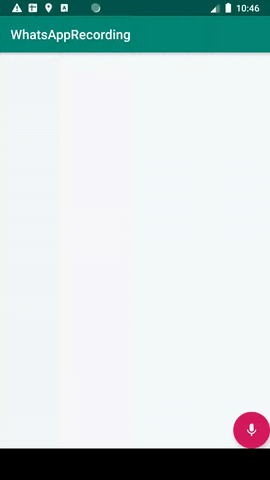

# WhatsappRecording
WhatsApp like audio recording animations and views sample for Android.  

 


Hold the mic and the timer will start (starts voice recording), now you
can slide left to cancel or slide up to lock, release the mic to send
(stops recording and sends the voice note). Although you have to write
the code for recording audio and saving yourself. This sample will only
give you the views and animations, perhaps the difficult part.
GOODLUCK!!!

First need to add AudioRecordView in xml resource layout file.

```
<com.iamrajendra.recordingbutton.customui.AudioRecordingButton
        android:id="@+id/dd"
        android:layout_alignParentRight="true"
        android:layout_alignParentBottom="true"
        android:layout_width="wrap_content"
        android:layout_height="wrap_content"/>
```

Now get the AudioRecordView in Activity and add the callback listeners.

```
public class MainActivity extends AppCompatActivity implements RecordingListener {
    AudioRecordingButton audioRecordingButton;
    @Override
    protected void onCreate(Bundle savedInstanceState) {
        super.onCreate(savedInstanceState);
        setContentView(R.layout.activity_main);
        audioRecordingButton = findViewById(R.id.dd);
        audioRecordingButton.setRecordingListener(this);
    }

    @Override
    public void onRecordingStarted() {
        show("recording started");
    }

    private void show(String recording_started) {
        Toast.makeText(getApplicationContext(),recording_started,Toast.LENGTH_LONG).show();
    }

    @Override
    public void onRecordingLocked() {
        show("recording locked");

    }

    @Override
    public void onRecordingCompleted() {
        show("recording completed");

    }

    @Override
    public void onRecordingCanceled() {
show("recording cancel");
    }
}


```


## About Me
Rajendra Verma<br />
Sr. Android Developer<br />
rajendrarajaram@hotmail.com<br />
Follow me https://iamrajendra.github.io/ for other samples and libraries like these

**If you like this sample then please add a star on this project :)**


## License
```
   Copyright 2020  Rajendra Verma

   Licensed under the Apache License, Version 2.0 (the "License");
   you may not use this file except in compliance with the License.
   You may obtain a copy of the License at

       http://www.apache.org/licenses/LICENSE-2.0

   Unless required by applicable law or agreed to in writing, software
   distributed under the License is distributed on an "AS IS" BASIS,
   WITHOUT WARRANTIES OR CONDITIONS OF ANY KIND, either express or implied.
   See the License for the specific language governing permissions and
   limitations under the License.
```
